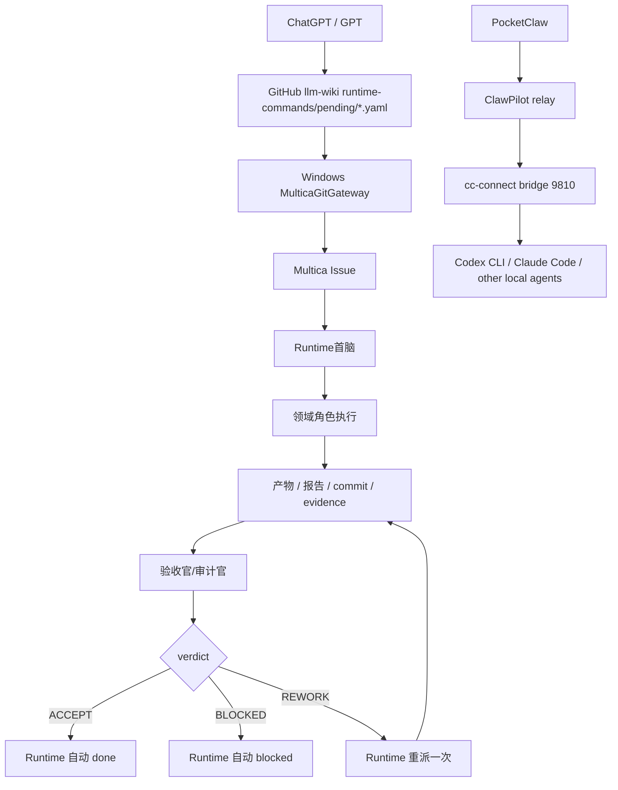

# 2026-05-10 下班交接与知识沉淀

## 001 一页结论

当前系统已经从“人肉转发任务”推进到“ChatGPT/GPT 通过 GitHub command file 发任务，Runtime 首脑分派，领域角色执行，验收官输出 verdict，Runtime 自动收口”的闭环。

今日最关键的稳定性修复是：Runtime 首脑从执行角色中剥离，只保留入口识别、分派、状态机、超时治理和按验收 verdict 收口；新增并固化验收官/审计官，解决 `in_review` 原地打转的问题。

Windows Coding Agent 主机已按 `cc-connect` + ClawPilot/PocketClaw 路线打通，`cc-connect` Bridge 与 Management API 已监听，ClawPilot relay 已连接。Codex CLI 使用 `gpt-5.5` 固定配置，API key 只保留在本机环境变量或本地 secret storage，不进入 Multica issue 评论和 Wiki。

截至收尾检查，Multica `in_review` 队列为 0。仍需要后续处理的是若干历史 blocked 任务，优先级最高的是 Windows C 盘摸排与 GitHub approved gateway 旧测试的收尾。

## 002 当前运行拓扑



## 003 固化角色

| 角色 | 定位 | 当前状态 | 关键边界 |
| --- | --- | --- | --- |
| Runtime首脑 | 入口、分派、状态机、超时治理、按 verdict 收口 | working | 禁止执行业务任务、写报告、写文件、补证据、git push |
| 验收官/审计官 | 独立验收，输出 `ACCEPT/BLOCKED/REWORK` | working | 禁止补做原任务，禁止直接关闭业务 issue |
| 研究与架构官 | 研究、方案、规范、架构、路线 | idle | 不做生产/本机执行 |
| 数据开发专家 | SQL、数据质量、沙箱、表级根因 | idle | 只读生产，禁止 DDL/DML，禁止改 Dolphin/DataX |
| 运维/资产管家 | Windows/Linux 资产、C/D 盘、服务、工具链、目录治理 | idle | 可做安全本地工具链修复；不打印密钥，不碰生产 DB |
| 数仓运行管家-暂停重建 | 暂停派单 | idle | 等 runtime/auth/timeout 修复后再恢复 |

## 004 Runtime 收口规则

验收官每条 verdict 评论必须 mention Runtime首脑，并包含机器可读字段：

```text
verdict: ACCEPT | BLOCKED | REWORK
status_action: done | blocked | rework_once
next_command_or_decision: <Runtime 可执行命令或明确决策>
```

Runtime 收口规则：

- `ACCEPT` -> `done`
- `BLOCKED` -> `blocked`
- `REWORK` -> 重派一次；第二次失败转 `blocked`
- `in_review` 超过 30 分钟必须处理
- `in_review` 超过 60 分钟且需要用户确认，必须转 `blocked`
- 禁止输出“等待用户决策”后继续保持 `in_review`
- Runtime 不允许替领域角色补写 mock artifact、报告、SQL、运维结果或 commit

## 005 Windows PocketClaw / cc-connect 主机沉淀

目标主机：Windows `hermes@10.100.35.154`

已完成：

- `clawpilot` 已升级到最新版路径，版本检查通过。
- Windows 主机已执行过 `clawpilot install`。该命令在 SSH 非管理员环境下无法激活旧式 Windows service，但配对配置已写入。
- `cc-connect` 已安装并验证可运行。
- `cc-connect` 使用 Codex 项目：
  - project: `codex-windows`
  - agent type: `codex`
  - model: `gpt-5.5`
  - work_dir: `D:\AIWorker\pocketclaw-work`
  - management port: `9820`
  - bridge port: `9810`
  - placeholder platform port: `18080`
- 因当前 `cc-connect daemon` 明确不支持 Windows，已使用 Windows Scheduled Task 作为 daemon 替代：
  - `cc-connect-daemon`
  - `clawpilot-relay`
- `clawpilot-relay` 日志已确认：
  - relay connected
  - bridge connected
  - PocketClaw 已能请求 models/projects/sessions 等能力

运行检查命令：

```powershell
Get-NetTCPConnection -LocalPort 9810,9820,18080 -ErrorAction SilentlyContinue
Get-ScheduledTask -TaskName cc-connect-daemon,clawpilot-relay
clawpilot status
```

刷新配对码命令：

```powershell
clawpilot pair --runtime ccconnect
```

注意：配对码是一次性短期码，不应写入知识库。

## 006 Codex CLI 与模型配置沉淀

Windows Codex CLI 已恢复并 smoke test 通过：

- `codex --version` 可用
- provider base URL 使用 OpenAI-compatible endpoint
- model 固定为 `gpt-5.5`
- API key 存在 Windows 用户环境变量或本地 secret storage
- 配置文件不应写入明文 API key

安全规则：

- 不在 Multica issue、Wiki、GitHub、报告中写出 API key。
- 已经暴露过的 key 必须视为 compromised，后续应旋转。
- 如需重新配置，使用本机 secret storage / custom_env，不通过评论传密钥。

## 007 GitHub Command Gateway 沉淀

当前任务入口约定：

```text
llm-wiki/runtime-commands/pending/*.yaml
```

处理结果回写：

```text
llm-wiki/runtime-commands/done/*.json
llm-wiki/runtime-commands/failed/*.json
```

安全模式：

- 默认 `mode: dry_run`
- 真实创建 Multica Issue 必须满足：
  - `mode: approved`
  - `approval: APPROVED_CREATE_ISSUE`
  - `approved_by: <明确审批人>`
- Runtime 只把 GitHub command file 当作 intake，不执行业务任务。
- 已修复 Windows 输出解码和幂等问题，避免同一个 command 重复创建多个 smoke issue。

已验证链路：

- GPT/GitHub smoke 创建任务曾生成重复 LEE-45/46/47，后续通过幂等修复和 Runtime Closeout 清理。
- approved command 能创建真实低风险测试 issue。
- 真实业务路径用 LEE-51 验证过：GPT 发起 `ads_gx_xs_04_02` 今日报表分析，经过 Runtime -> 数据开发专家 -> 验收官 -> Runtime 收口，最终 done。

## 008 今日关键 Issue 结果

| Issue | 主题 | 状态 | 结论 |
| --- | --- | --- | --- |
| LEE-40 | ACCEPT 路径 dry-run | done | Runtime/验收官 ACCEPT 收口可用 |
| LEE-41 | BLOCKED 路径 dry-run | blocked | BLOCKED 收口可用 |
| LEE-42 | REWORK 路径 dry-run | blocked | 可重派一次，二次失败 blocked |
| LEE-43 | REWORK 复测 | blocked | 可用执行器路径仍需减少噪声 |
| LEE-44 | Runtime 直派不得代写产物 | done | 入口守卫验证通过 |
| LEE-45/46/47 | GitHub smoke 重复任务 | done/cancelled | 幂等修复前遗留已清理 |
| LEE-48 | GitHub smoke duplicate cleanup | done | Runtime Closeout 可执行 |
| LEE-51 | GPT 发起 ads_gx_xs_04_02 分析 | done | 真实完整流程跑通 |
| LEE-52 | Codex CLI/工具链 | done | 资产管家任务已收口 |
| LEE-53 | 验收官 mention Runtime 自动收口 | done | 不需要额外用户评论即可自动收口 |

## 009 当前 blocked 与明日优先级

优先处理：

1. `LEE-31` Windows C 盘部署物摸排与迁移到 D 盘方案
   - 当前负责人：运维/资产管家
   - 建议动作：只读摸排 C 盘，输出迁移候选、不可迁移清单、服务/计划任务/环境变量引用风险；不执行迁移。

2. `LEE-49` GPT GitHub approved 创建 Multica Issue 验证
   - 当前 blocked
   - 建议动作：核对对应 command 的 done/failed JSON 是否已推送；若已存在 issue_created 或 issue_already_exists，交验收官判 ACCEPT，否则补 gateway 结果。

3. `LEE-50` ads_gx_xs_04_02 旧版任务
   - 已被 LEE-51 替代并完成
   - 建议动作：验收官确认替代关系后转 blocked/cancelled 或 done，避免重复分析。

4. `LEE-29` 数仓重构前全量摸排
   - 当前 blocked
   - 建议动作：核对 Wiki push/P0 缺口；不要让 Runtime 自己补报告。

5. `LEE-38` 批量验收旧任务
   - 已被 LEE-39 顺序验收闭环替代
   - 建议动作：保留 blocked，并在后续总账里注明 replaced_by=LEE-39。

## 010 知识库索引

今日以后优先查这些文档：

- `20-resources/system-runtime-overview.md`
- `20-resources/agent-collaboration-runtime.md`
- `20-resources/agent-role-operating-model.md`
- `20-resources/four-node-runtime-inventory.md`
- `20-resources/codex-multica-command-gateway-spike.md`
- `20-resources/multica-command-gateway-spike-report.md`
- `20-resources/multica-command-gateway-update-status-spike-report.md`
- `20-resources/pocketclaw-loop-heartbeat.md`
- `20-resources/chatgpt-current-command-post-20260510.md`
- `20-resources/20260510-end-of-day-knowledge-handoff.md`

## 011 明日开工检查清单

```bash
multica issue list --status in_review --limit 50
multica issue list --status blocked --limit 50
multica agent list --output json
```

Windows 主机：

```powershell
Get-NetTCPConnection -LocalPort 9810,9820,18080 -ErrorAction SilentlyContinue
Get-ScheduledTask -TaskName cc-connect-daemon,clawpilot-relay
clawpilot status
codex --version
cc-connect --version
```

GitHub gateway：

```powershell
Set-Location D:\AIWorker\llm-wiki
git status --short
git log --oneline -5
Get-ChildItem runtime-commands\pending
Get-ChildItem runtime-commands\done | Select-Object -Last 10
Get-ChildItem runtime-commands\failed | Select-Object -Last 10
```

## 012 安全边界

继续遵守：

- 不修改生产数据库、PolarDB、DolphinScheduler、DataX。
- 不执行 `INSERT/UPDATE/DELETE/DROP/ALTER/TRUNCATE/CREATE`。
- 不重跑生产调度。
- 不删除文件。
- 不 force push。
- 不把 API key、token、密码、连接串写进 issue、Wiki、GitHub 或报告。
- 所有生产相关任务默认只读，写操作必须单独人工批准。

## 013 当前阶段判断

当前进入“有限正式运行 + 强治理”阶段：

- 任务入口和状态机已具备可用闭环。
- 角色边界已经基本成型。
- GitHub 作为 GPT task ingress 已验证。
- PocketClaw/cc-connect Windows Coding Agent 主机已可用。
- 仍需补强的是历史 blocked 清理、C 盘资产摸排、密钥轮换、Kimi/Claude auth 稳定性，以及 GitHub gateway 的持续可观测性。

