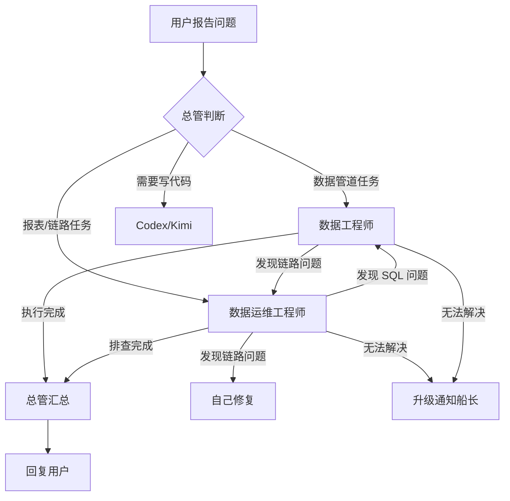

# 异常流转协议

## 核心原则

**缺的不是角色，是角色之间的异常流转协议。**

## 流转规则



## 路由规则

| 任务类型 | 路由到 | 判断依据 |
|---------|--------|---------|
| 写 SQL、建表、ETL | 数据工程师 | 关键词：SQL、建表、ETL、数仓、数据质量 |
| 报表开发、巡检、排查 | 数据运维工程师 | 关键词：报表、告警、链路、排查、异常 |
| 执行代码 | Codex | 关键词：执行、运行、跑脚本 |
| 复杂代码推理 | Kimi K2.6 | 总管判断复杂度 |

## 回退机制

当一个 Agent 发现问题不属于自己：

```
数据运维排查发现 SQL 逻辑问题
    → 返回总管，标注「SQL问题」
    → 总管 delegate_task 给数据工程师

数据工程师发现是 DataX 链路问题
    → 返回总管，标注「链路问题」
    → 总管 delegate_task 给数据运维
```

## 升级机制

当两个 Agent 都无法解决：

```
1. 数据运维尝试排查 → 无法定位
2. 数据运维返回总管 → 标注「需要人工介入」
3. 总管通知船长（飞书消息）
4. 船长决定下一步
```

## 高风险操作确认

以下操作必须人工确认（船长或用户）：

| 操作 | 确认方式 |
|------|---------|
| DDL 变更（CREATE/DROP/ALTER） | 总管先展示 SQL，用户确认后执行 |
| 生产环境写操作 | 总管展示影响范围，用户确认 |
| 批量数据修改 | 总管展示影响行数，用户确认 |
| 调度配置变更 | 总管展示变更内容，用户确认 |

## 超时和重试

| 配置 | 值 |
|------|-----|
| 子代理超时 | 300 秒（5 分钟） |
| 最大重试 | 2 次 |
| 重试策略 | 失败后回退总管，总管决定是否重试 |

## 相关文档

- [[架构总览]]
- [[角色设计]]
- [[编排机制]]
