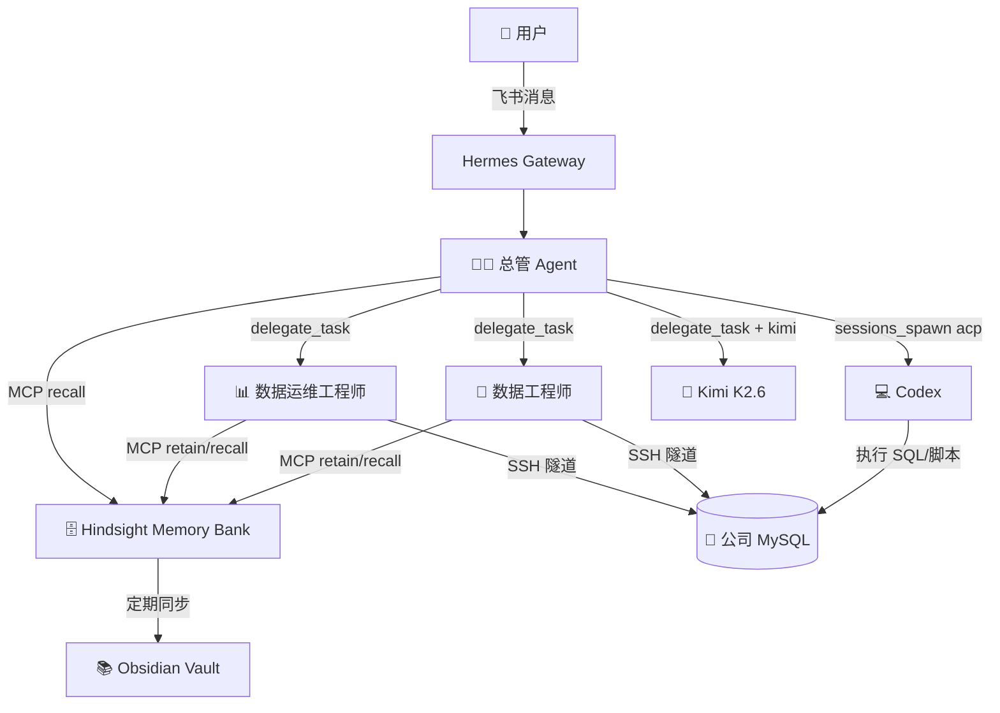

# 架构总览

## 整体架构

## 组件清单

| 组件 | 类型 | 模型 | 说明 |
|------|------|------|------|
| 🧑‍💼 总管 | 常驻 | mimo-v2.5-pro | 需求理解、任务拆解、路由、汇总 |
| 🔧 数据工程师 | 常驻 | mimo-v2.5-pro | SQL/ETL/数仓建模 |
| 📊 数据运维工程师 | 常驻 | mimo-v2.5-pro | 报表开发/链路巡检/异常排查 |
| 💻 Codex | 按需 | ACP 模式 | 代码执行沙盒 |
| 🧠 Kimi K2.6 | 按需 | kimi-k2.6 | 复杂代码推理（额度有限） |

## 知识层

| 组件 | 用途 |
|------|------|
| Hindsight | 结构化知识存储（retain/recall/reflect） |
| Obsidian | 知识可视化（图谱、文档、模板） |

## 编排通道

| 通道 | 用途 |
|------|------|
| delegate_task | Agent 间任务分派 |
| MCP | Agent ↔ 知识库交互 |
| sessions_spawn(acp) | 调用 Codex 执行代码 |

## 相关文档

- [[角色设计]]
- [[模型策略]]
- [[异常流转协议]]
- [[知识管理规范]]
- [[编排机制]]
- [[部署清单]]
