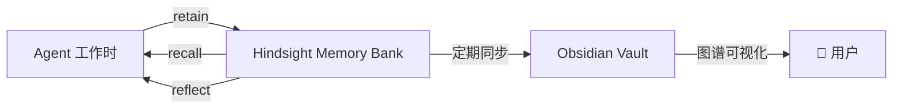

# 知识管理规范

## 架构



## 三个 Memory Bank

| Bank | 用途 | 谁写入 | 谁读取 |
|------|------|--------|--------|
| chief | 全局决策、流程规范 | 总管 | 所有 |
| de | 数据字典、表结构、ETL 知识 | 数据工程师 | 总管、数据运维 |
| sre | 排查案例、链路知识、运维经验 | 数据运维 | 总管、数据工程师 |

## 知识归属规则

一条知识涉及多角色时：
- **主 Bank**：产出该知识的角色
- **副 Bank**：通过 wikilink 引用，不重复存储

示例：
- 表结构文档 → 主 Bank: de，chief 和 sre 通过 recall 检索
- 排查案例 → 主 Bank: sre，de 通过 recall 检索

## Agent 操作规范

### 总管
- `recall`：做决策前检索相关知识
- `retain`：记录决策结果和原因

### 数据工程师
- `retain`：建表后记录表结构、字段含义、血缘关系
- `retain`：ETL 完成后记录逻辑和注意事项
- `recall`：写 SQL 前检索相关表结构

### 数据运维工程师
- `retain`：排查完成后记录案例（问题→根因→修复方案）
- `retain`：巡检发现异常时记录
- `recall`：排查时检索历史案例

## Obsidian Vault 结构

```
📁 Vault/
├── 📊 系统设计/          ← 设计文档（手动维护）
├── 📖 数据字典/          ← Hindsight 同步（自动）
├── 🔍 排查案例/          ← Hindsight 同步（自动）
├── 📋 业务口径/          ← Hindsight 同步（自动）
└── ⚙️ 运维知识/          ← Hindsight 同步（自动）
```

## Front-matter 模板

```yaml
---
title: 文档标题
author: 创建者（Agent 名称）
status: 草稿/已确认/已废弃
tags: [标签1, 标签2]
created: 2026-05-04
updated: 2026-05-04
related: [[关联文档1]], [[关联文档2]]
---
```

## 相关文档

- [[架构总览]]
- [[部署清单]]
