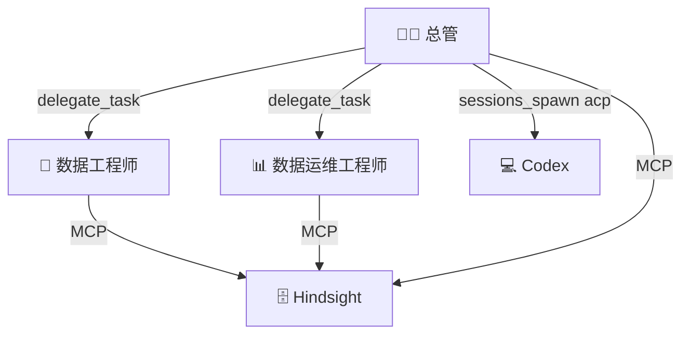

# 编排机制

## 三条通道



## 1. delegate_task（Agent 间分派）

**用途：** 总管把任务分派给专业 Agent

**配置：**
```yaml
delegation:
  model: "mimo-v2.5-pro"
  provider: "openai-compatible"
  max_concurrent: 2
  timeout: 300
  blocked_tools:
    - "gateway"
    - "config"
    - "profile"
```

**使用示例：**
```
delegate_task(
    goal="查询昨天的订单量，按渠道分组",
    context="数据库 MySQL，表名 dws_order_daily，日期字段 dt，渠道字段 channel",
    toolsets=["terminal", "file"]
)
```

## 2. MCP（Agent ↔ 知识库）

**用途：** Agent 与 Hindsight 交互

**三个操作：**
- `retain` — 存储知识
- `recall` — 检索知识
- `reflect` — 反思生成新洞察

**配置：**
```yaml
mcp:
  servers:
    hindsight-chief:
      url: "http://localhost:8080/mcp/chief"
    hindsight-de:
      url: "http://localhost:8080/mcp/de"
    hindsight-sre:
      url: "http://localhost:8080/mcp/sre"
```

## 3. sessions_spawn acp（调用 Codex）

**用途：** 总管调用 Codex 执行代码

**使用示例：**
```python
sessions_spawn(
    runtime="acp",
    agentId="codex",
    mode="run",
    task="执行以下 SQL: CREATE TABLE orders (...)"
)
```

## 跨 Agent 知识共享

数据运维需要数据工程师的知识：
```
数据运维 recall → hindsight-de bank → 获取表结构信息
```

不需要经过总管中转，直接通过 MCP 跨 Bank 检索。

## 相关文档

- [[架构总览]]
- [[异常流转协议]]
- [[角色设计]]
