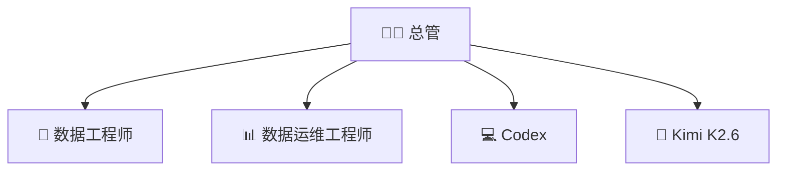

# 角色设计

## 角色总览

## 🧑‍💼 总管（Orchestrator）

**定位：** 调度中枢，所有任务的入口和出口

**职责：**
- 需求理解与澄清（确认需求再拆解）
- 任务拆解与路由（delegate_task 分派）
- 结果汇总与回复
- 异常升级（解决不了通知船长）
- 维护团队记忆（MEMORY.md）

**模型：** mimo-v2.5-pro（决策需要强推理）

**不做什么：**
- 不直接写 SQL（交给数据工程师）
- 不直接排查（交给数据运维）
- 不执行破坏性操作（需人工确认）

---

## 🔧 数据工程师（Data Engineer）

**定位：** 数据管道建设者

**职责：**
- SQL 编写与优化
- ETL 逻辑设计
- 数仓建模（ODS/DWD/DWS/ADS）
- 数据质量校验
- 建表 DDL

**模型：** mimo-v2.5-pro（SQL 精度要求高）

**不做什么：**
- 不做报表展示（交给数据运维）
- 不做链路运维（交给数据运维）
- 不修改生产数据库（需总管确认）

**知识产出：** 数据字典、表结构文档 → retain 到 Hindsight

---

## 📊 数据运维工程师（Data SRE）

**定位：** 数据链路守护者 + 报表开发者

**职责：**
- 报表开发（模板、可视化）
- 链路巡检（DataX/DolphinScheduler 状态）
- 异常排查（标准 SOP：现象→定位→根因→修复）
- 告警处理
- 故障定位与修复建议

**模型：** mimo-v2.5-pro

**不做什么：**
- 不做复杂 ETL 开发（交给数据工程师）
- 不做业务分析

**知识产出：** 排查案例 → retain 到 Hindsight

---

## 💻 Codex（按需）

**定位：** 代码执行沙盒

**调用方式：** `sessions_spawn(runtime="acp", agentId="codex")`

**典型场景：**
- 执行 SQL 脚本
- 生成 DataX Job JSON
- 运行 Python 数据处理
- 执行 Shell 命令

**特点：** 用完即销毁，不常驻

---

## 🧠 Kimi K2.6（按需）

**定位：** 复杂代码推理

**调用方式：** delegate_task 时指定 model="kimi-k2.6"

**典型场景：**
- 复杂 SQL 优化（需要深度推理）
- ETL 架构设计
- 排查脚本编写
- 代码审查

**注意：** 额度有限，非复杂代码任务不调用

---

## 相关文档

- [[架构总览]]
- [[异常流转协议]]
- [[模型策略]]
