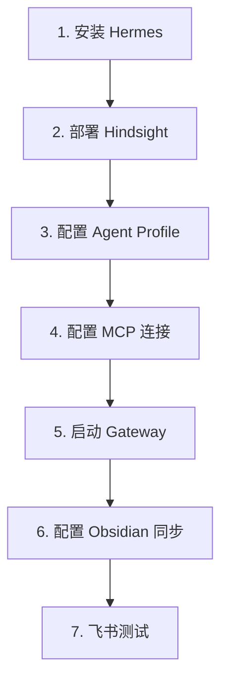

# 部署清单

## 文件总览

共 25 个文件，分为 5 大类。

## 1. 核心部署

| 文件 | 说明 |
|------|------|
| docker-compose.yml | Hindsight + PostgreSQL + UI + Sync 四服务 |
| .env.example | 环境变量模板 |
| setup-banks.sh | 一键初始化 3 个 Memory Bank |

## 2. Hermes Agent 集成

| 文件 | 说明 |
|------|------|
| hermes-config.yaml | 完整 Hermes 配置（双模型 + 压缩优化） |
| agents/chief-agent.md | 总管系统提示词 |
| agents/de-agent.md | 数据工程师系统提示词 |
| agents/sre-agent.md | 数据运维工程师系统提示词 |

## 3. Obsidian 同步

| 文件 | 说明 |
|------|------|
| sync/sync_hindsight.py | 核心同步脚本（~450 行） |
| sync/sync_config.yaml | 同步配置 |
| sync/Dockerfile | 同步服务容器镜像 |
| sync/requirements.txt | Python 依赖 |
| sync/hindsight_sync.service | systemd 服务文件 |

## 4. Obsidian Vault

| 文件 | 说明 |
|------|------|
| obsidian/vault-structure.md | Vault 目录结构设计 |
| obsidian/templates/*.md | 4 个模板 |
| obsidian/.obsidian/app.json | Obsidian 配置 |
| obsidian/.obsidian/graph.json | 图谱颜色配置 |

## 5. 示例 & 文档

| 文件 | 说明 |
|------|------|
| examples/retain-table-schema.sh | retain 表结构示例 |
| examples/retain-troubleshoot.sh | retain 排查案例示例 |
| examples/recall-knowledge.sh | recall + reflect 示例 |
| docs/integration-guide.md | 4 步部署指南 |
| docs/memory-optimization.md | 8GB 内存优化方案 |

## 部署顺序

## 相关文档

- [[架构总览]]
- [[模型策略]]
- [[知识管理规范]]
