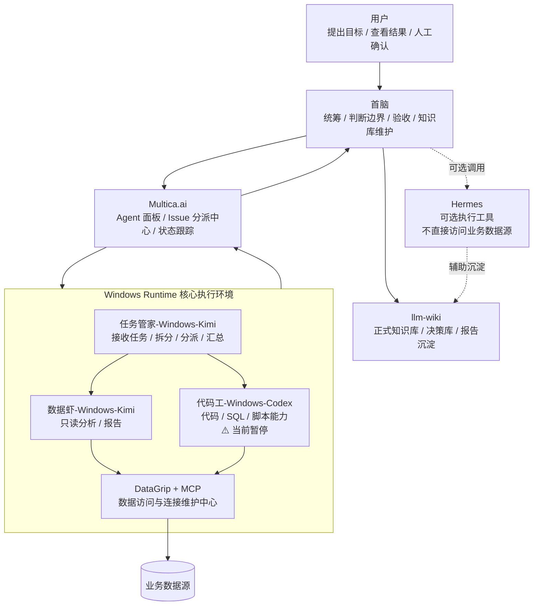
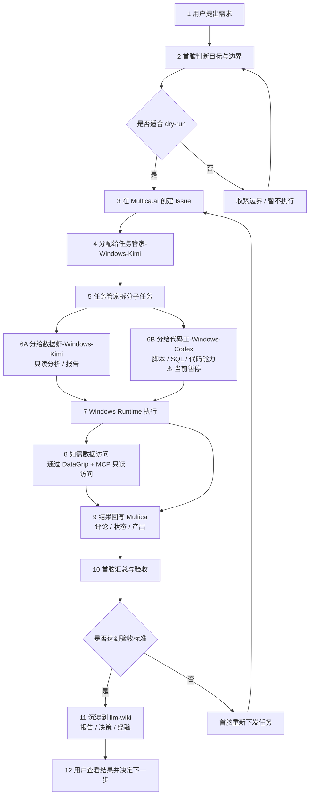

# AI数仓协作架构图与流程

## 1. 结论

当前采用“首脑判断、Multica.ai 分派、Windows Runtime 执行、DataGrip/MCP 统一数据访问、llm-wiki 沉淀”的协作结构。

## 2. 当前架构图

## 3. 任务流程图

## 4. 角色分工

| 角色 | 定位 | 主要职责 | 当前边界 |
|---|---|---|---|
| 用户 | 最终确认人 | 提目标、看结果、做人工确认 | 不维护复杂链路 |
| 首脑 | 统筹与验收 | 判断边界、分派方向、验收、知识库维护 | 不越权执行高风险动作 |
| Multica.ai | 任务平台 | Issue、Agent 分派、状态跟踪 | 不替代 llm-wiki |
| 任务管家-Windows-Kimi | 任务中转 | 接收、拆分、分派、汇总 | 不做最终决策 |
| 数据虾-Windows-Kimi | 数据分析 | 只读分析、报告输出 | 不做写入动作 |
| 代码工-Windows-Codex | 代码能力 | 脚本、SQL、代码生成和检查 | ⚠️ 当前暂停 |
| DataGrip + MCP | 数据访问出口 | 连接维护、只读能力出口 | 不向 Agent 暴露敏感连接信息 |
| llm-wiki | 知识库 | 决策、报告、经验沉淀 | 不保存敏感明细 |

## 5. 本轮运行原则

- 先 dry-run，后只读验证；
- 数据访问统一走 Windows MCP；
- Multica 负责任务分派和状态跟踪；
- 首脑负责最终判断与收口；
- llm-wiki 负责正式沉淀；
- Kimi 优先用于中文理解、任务整理、报告汇总；
- Codex 只作为代码能力工具，不作为主控（⚠️ 当前暂停）。

## 6. 下一步建议

1. 等待任务管家链路 dry-run 完成；
2. 记录 Codex 当前可用性状态；
3. 完成 Windows MCP 只读能力 dry-run；
4. 再进入 ADS_SC_XL_13 样板链路准备；
5. 阶段完成后更新本页或对应报告。

## 7. 来源路径

- `wiki/outputs/当前决策总账.md`
- `wiki/operations/Windows数据库MCP访问规范.md`
- `wiki/warehouse/数据访问只读安全边界.md`
- `wiki/outputs/Multica任务管家链路dry-run验证报告.md`
